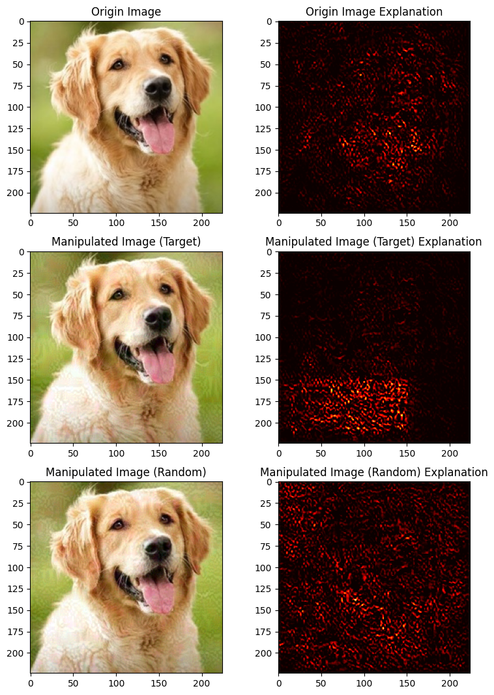
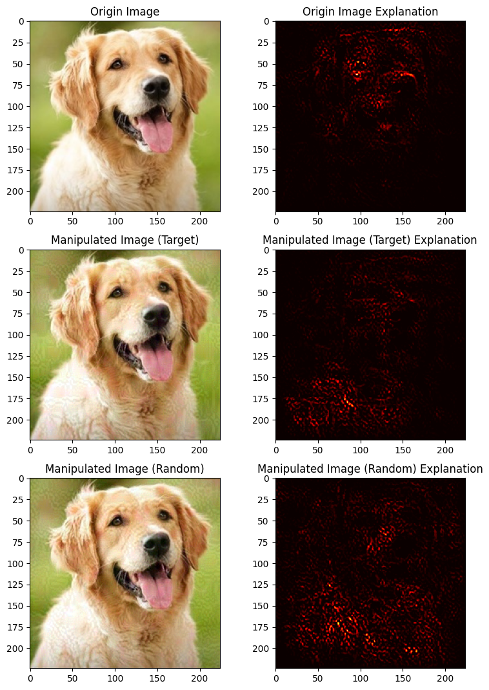
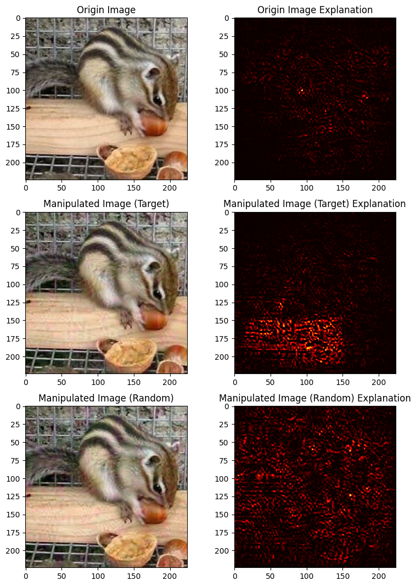

<!-- PROJECT LOGO -->
 

  <h1 align="center">Demo For XAI Attacker</h1>

<!-- ABOUT THE PROJECT -->
## About The Project

First step into advXAI

We trained a ResNet34 model to classify images sized $224 \times 224$ into 10 categories: Dog, Horse, Deer, Elephant, Butterfly, Chicken, Cat, Cow, and Squirrel. Subsequently, we applied attacks on the model's explanations of Gradient or Integrated Gradient methods.

We designed an adversarial attack on a black-box model where the changes in the input are noticeable to humans. Despite these changes, the model continues to make accurate predictions. However, the explanations provided by the black-box model are manipulated, either randomly or towards a given target.

<table align="center">
  <tr>
    <td align="center">
       
      <b>Gradient Based Explanation</b>
    </td>
    <td align="center">
       
      <b>Integrated Gradient Explanation</b>
    </td>
  </tr>
</table>

<table align="center">
  <tr>
    <td align="center">
       
      <b>Gradient Based Explanation</b>
    </td>
    <td align="center">
       
      <b>Integrated Gradient Explanation</b>
    </td>
  </tr>
</table>

<!-- CONTACT -->
## Contact

Email:
- mttrung16@gmail.com
- tanlocnguyen1902@gmail.com

